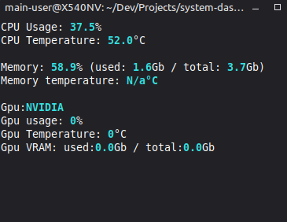
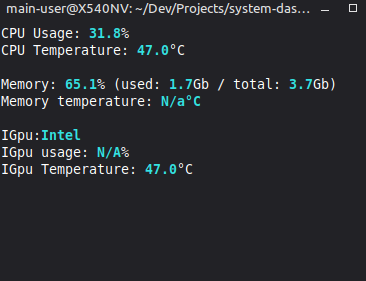
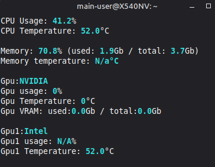
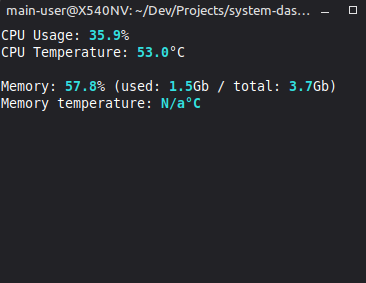
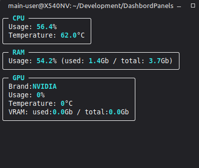
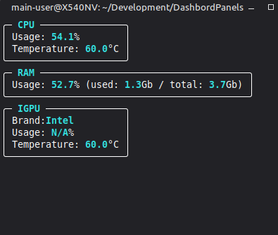
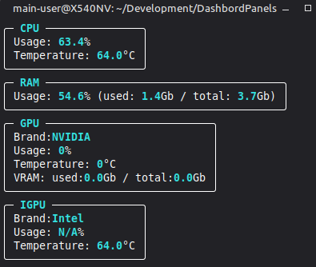
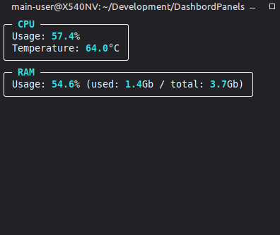

# System Dashboard

A stylish, minimalist TUI dashboard for monitoring your PC's system components in real time.

**Built exclusively for Linux.**

## Features

The dashboard displays:

- **CPU status** — load, temperature
- **RAM status** — usage percentage, used space (GB), total capacity
- **GPUʼ status** — discrete NVIDIA and integrated Intel graphics, shown together or separately depending on available hardware (load, temperature, used VRAM, total VRAM)

## Supported hardware

**CPU:** any processor for which `psutil`/`lm-sensors` can find a temperature sensor (Intel `coretemp`, AMD `k10temp`/`zenpower`, and a few other common variants).

**GPU:** NVIDIA only (via `nvidia-smi`) and integrated Intel graphics. AMD discrete GPUs are not currently supported.

**RAM:** any RAM works, though temperature sensor availability isn't guaranteed on all models.

## Known limitations

- No support for AMD GPUs (no hardware available for testing)
- Possible bugs — the dashboard was built by a single person and hasn't undergone wide-scale testing

## Screenshots

**Dashborad Classic preview in terminal:**

Dashboard with NVIDIA GPU:

Dashboard with Intel iGPU:

Dashboard with NVIDIA GPU + Intel iGPU:

Dashboard if NVIDIA GPU and Intel iGPU are not found by the program:

**Dashborad with Rich Panels preview in terminal:**

Dashboard with NVIDIA GPU:

Dashboard with Intel iGPU:

Dashboard with NVIDIA GPU + Intel iGPU:

Dashboard if NVIDIA GPU and Intel iGPU are not found by the program:

## Running

1. Open a terminal in the dashboard's project folder
2. Run:

\`\`\`bash
python3 Main.py
\`\`\`

## Requirements

- Python 3.x
- `psutil`
- `rich`
- For NVIDIA GPU support: NVIDIA drivers installed (`nvidia-smi` must be available in PATH)